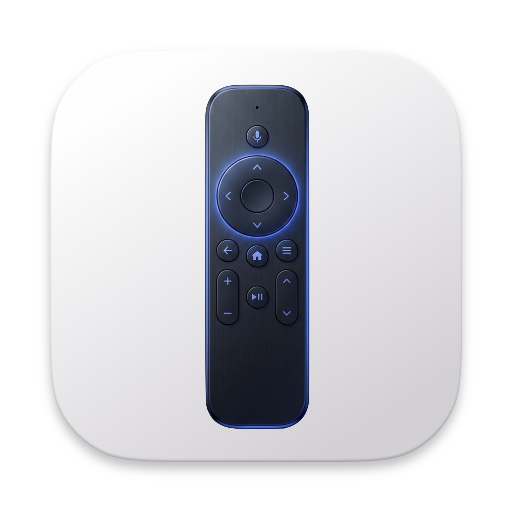

# GTV Desktop Remote

GTV Desktop Remote is a macOS desktop remote for Google TV and Android TV devices. It lets you discover a TV on your local network, pair it once, and then control it from your Mac using either on-screen buttons or your keyboard.

## What It Does

- Scans your local network for compatible Google TV and Android TV devices
- Saves and remembers paired devices
- Sends navigation, home, back, media, volume, and power commands
- Supports keyboard-based remote control
- Sends text input to apps that expose Android TV text entry support

## Before You Start

Make sure your TV or streaming device has Android TV Remote Service available and is on the same local network as your Mac.

## Getting Started

1. Launch the app.
2. Let it scan for devices on your network.
3. Select your TV from the device list.
4. Start pairing if the device is not already paired.
5. Enter the 6-character pairing code shown on the TV.
6. Once pairing completes, connect and start using the remote.

After the first successful pairing, the app remembers the device so future reconnects are faster.

## How To Use The Remote

The remote view gives you direct access to:

- Directional navigation
- Select / OK
- Home
- Back
- Play / pause
- Volume up and volume down
- Power
- Text input, when the current app on the TV supports it

If text input is available, open the keyboard panel in the app, type your message, and send it to the TV.

## Keyboard Shortcuts

You can drive the TV directly from your Mac keyboard when the remote is connected and the app is focused.

- `ArrowUp`: Up
- `ArrowDown`: Down
- `ArrowLeft`: Left
- `ArrowRight`: Right
- `Enter`: Select / OK
- `Escape`: Back
- `Backspace`: Back
- `H`: Home
- `Space`: Play / pause
- `K`: Play / pause
- `+` or `=`: Volume up
- `-` or `_`: Volume down
- `P`: Power

Modifier shortcuts such as `Cmd`, `Ctrl`, and `Option` are ignored so they do not interfere with normal macOS shortcuts.

## Menu Bar Shortcut

The app also registers a global shortcut so you can show or hide the remote quickly:

- `CmdOrCtrl+Shift+G`

## Troubleshooting

If the TV does not appear or pairing does not complete:

1. Confirm the TV and Mac are on the same network.
2. Confirm Android TV Remote Service is available on the TV.
3. Retry the network scan.
4. Start a fresh pairing session and enter the newest code shown on the TV.

If needed, you can remove a saved device in the app and pair it again.

## For Developers

Development setup, packaging, debug telemetry, and local build workflows are documented in [DEVELOPMENT.md](DEVELOPMENT.md).