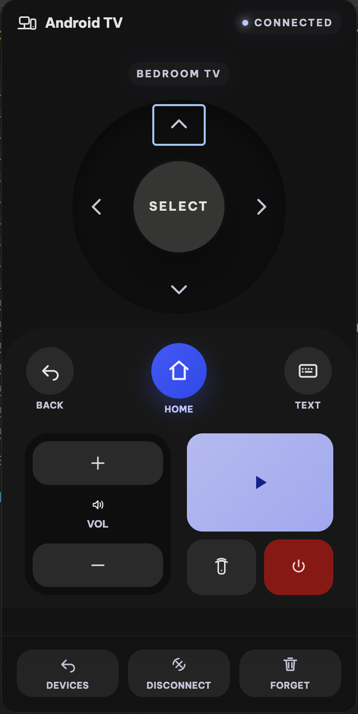
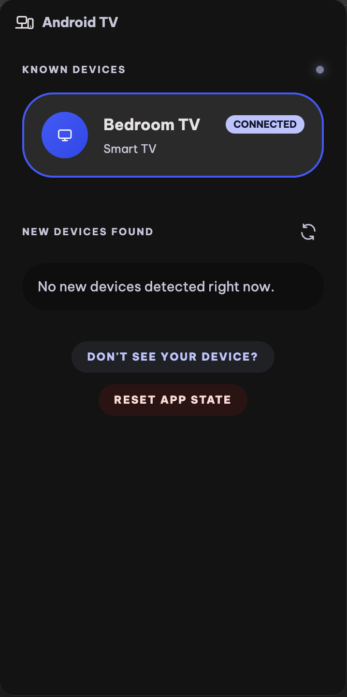

  

  <h1>GTV Desktop Remote</h1>

  
<strong>A macOS desktop remote for Google TV and Android TV devices.</strong> 
  Discover, pair once, and control your TV from your Mac — with keyboard support.

  

    
    
    
    
    
  

---

## Overview

GTV Desktop Remote lets you control any Google TV or Android TV device from your Mac. It runs as a menubar app — always one keystroke away — and uses the same encrypted pairing protocol as the official Android TV Remote app.

- **Network scan** — discovers compatible devices on your local network automatically
- **One-time pairing** — enter a 6-digit code once; credentials are saved securely
- **Full remote control** — navigation, select, home, back, play/pause, volume, power
- **Keyboard control** — drive your TV from the keyboard without touching the mouse
- **Text input** — send text directly to apps that support Android TV text entry
- **IP-change resilient** — device identity is tracked by MAC address, not IP, so re-pairing is never needed when your TV's IP changes
- **Global shortcut** — `CmdOrCtrl+Shift+G` shows or hides the remote from anywhere

---

## Screenshots

  <table>
    <tr>
      <td align="center" width="50%">
        
         
        <strong>Remote controls</strong>
      </td>
      <td align="center" width="50%">
        
         
        <strong>Device management</strong>
      </td>
    </tr>
  </table>

---

## Installation

Download the latest `.dmg` from the [Releases](https://github.com/usrivastava92/gtv-desktop-remote/releases/latest) page, open it, and drag the app to your Applications folder.

> **Requirement:** macOS. Your TV must have Android TV Remote Service enabled and be on the same local network as your Mac.

---

## Getting Started

1. Launch the app — it appears in your menu bar.
2. The app scans your network for compatible devices.
3. Select your TV from the device list.
4. If not yet paired, click **Start Pairing** and enter the 6-character code shown on your TV.
5. Once paired, click **Connect** — you're ready to use the remote.

The app remembers paired devices, so future connections are instant.

---

## Keyboard Shortcuts

When the remote is focused and connected, your keyboard controls the TV directly:

| Key                    | Action       |
| ---------------------- | ------------ |
| `↑` `↓` `←` `→`        | Navigate     |
| `Enter`                | Select / OK  |
| `Escape` / `Backspace` | Back         |
| `H`                    | Home         |
| `Space` / `K`          | Play / Pause |
| `+` / `=`              | Volume Up    |
| `-` / `_`              | Volume Down  |
| `P`                    | Power        |

> `Cmd`, `Ctrl`, and `Option` combinations are ignored so they don't interfere with normal macOS shortcuts.

**Global shortcut:** `CmdOrCtrl+Shift+G` — show or hide the remote from any app.

---

## Troubleshooting

**TV not appearing in the scan?**

- Confirm the TV and Mac are on the same Wi-Fi network.
- Confirm Android TV Remote Service is enabled on the TV.
- Try re-running the network scan.

**Pairing not completing?**

- Start a fresh pairing session and enter the latest code shown on the TV screen.
- If the device was previously saved, remove it and pair again.

---

## For Developers

Development setup, packaging, debug telemetry, and local build workflows are documented in [DEVELOPMENT.md](DEVELOPMENT.md).
